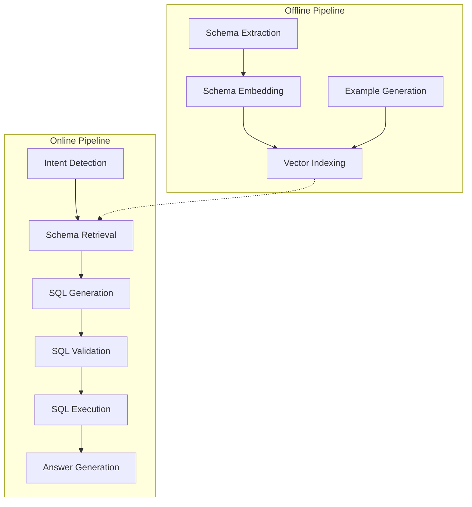

# Pipeline Services Documentation

The Text-to-SQL system architecture is built around two primary pipelines:

1. **[Offline Pipeline](./offline/README.md)**: Responsible for knowledge preparation, schema extraction, and vector indexing.
2. **[Online Pipeline](./online/README.md)**: Handles the runtime flow from natural language query to SQL execution and verification.

## Architecture Overview

Each step in these pipelines is implemented as a modular service under `ivanpham_chatbot_assistant/services/pipelines/`.
